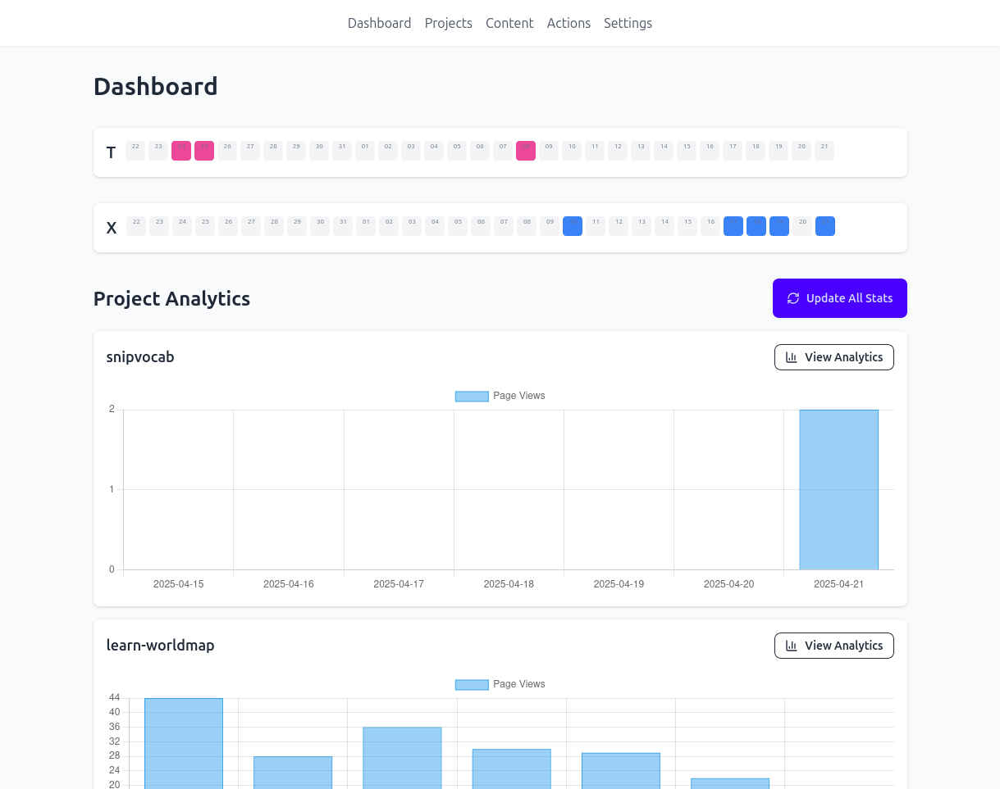

# Sideproject Management



A Django-based system for managing and tracking side projects, their repositories, deployments, and content.

## Features

- Project management with status tracking
- Repository integration
- Deployment tracking
- Content management
- Local folder synchronization

## Local Folder Synchronization

The system can automatically sync local project folders with the database. This feature:

- Creates Projects and Folders in the database based on your local directory structure
- Tracks folder modification times
- Automatically marks projects as ONLINE
- Updates existing entries when re-run

### Setup

1. Create a Settings object with your local projects folder path:
```python
from cms.models import Settings
Settings.objects.create(local_projects_folder='/path/to/your/projects')
```

2. Run the sync command:
```bash
python manage.py sync_local_folders
```

The command will:
- Create a Project for each folder found
- Set the project status to ONLINE
- Mark it as auto_generated
- Create a corresponding Folder entry
- Track the last modification time
- Update existing entries if they already exist

The command is safe to run multiple times as it uses `get_or_create` to avoid duplicates and updates existing entries when found.
